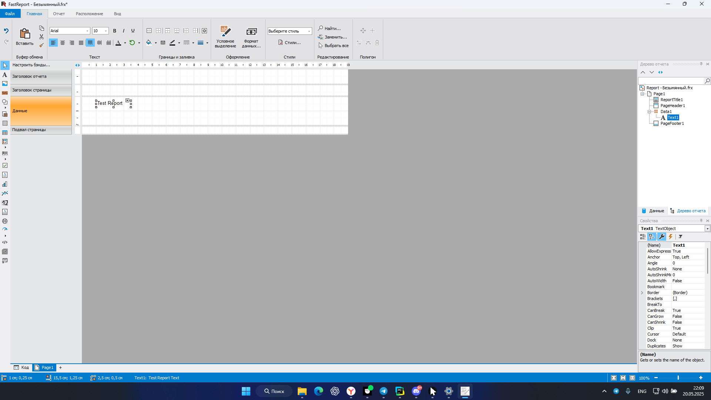

# testFastReport 🚀

Проект **testFastReport** — это набор автоматизированных UI-тестов для интерфейса **FastReport Designer** — инструмента для создания отчётов и форм.  
Тесты написаны на **Python** с использованием `pytest`, `PyAutoGUI`, `OpenCV`, и предназначены для:

- 🔁 Эмуляции пользовательских действий (клик, ввод текста, перетаскивание)
- 🔍 Проверки корректной работы интерфейса
- 🖼 Сравнения скриншотов с эталонными изображениями
- ⏱ Быстрого нахождения регрессий без ручной проверки

## 📌 Зачем нужен этот проект?

- ✅ **Автоматизация тестирования** FastReport Designer
- 💡 **Пример использования PyAutoGUI и OpenCV** в UI-тестировании
- 🧪 **Быстрое выявление багов и регрессий**
- 🚀 **Масштабируемость** — легко добавлять новые тесты

---

## 📂 Структура проекта

```text
testFastReport/
│
├── tests/                     # 📂 Основные UI-тесты (по функциям и сценариям)
│   ├── test_insert_textbox.py
│   ├── test_insert_shape.py
│   ├── test_insert_image.py
│   ├── test_change_properties.py
│   ├── test_drag_object.py
│   └── ...
│
├── utils/                     # 📂 Вспомогательные модули
│   ├── logger.py              # Логирование в файл + консоль
│   ├── images.py              # Работа со скриншотами
│   ├── image_matcher.py       # Поиск шаблонов на экране и клики по ним (PyAutoGUI + OpenCV)
│   ├── verifications.py       # Проверки "до/после" и сравнение с эталоном
│   └── actions.py             # Утилита для общих действий (открытие, создание объектов, ввод текста и т.д.)
│
├── data/                      # 📂 Данные для тестов
│   ├── coordinates.json       # Координаты элементов UI
│   ├── config.yaml            # Конфиги: паузы, разрешения, путь до exe и т.д.
│   └── templates/             # Шаблоны изображений для image_matcher (например, кнопки, элементы UI)
│
├── screenshots/               # 📂 Все скрины
│   ├── before/                # 📂 До действия
│   ├── after/                 # 📂 После действия
│   └── references/            # 📂 Эталонные скрины
│
├── logs/                      # 📂 Лог-файлы
│   └── ui_test.log
│
├── conftest.py                # Общие фикстуры для pytest (настройка окружения, логгер, действия)
├── requirements.txt           # Зависимости проекта
└── README.md                  # Краткое описание и инструкция
```

## ⚙️Требования

- **Python:** 3.8 или выше (рекомендуется 3.11 для лучшей совместимости).
- **Операционная система:** Windows (тесты используют PyAutoGUI, который зависит от разрешения экрана и раскладки клавиатуры).
- **FastReport Designer:** Установленная версия приложения (путь к .exe указывается в data/config.yaml).
  
- **Дополнительно:**
   - Разрешение экрана `1920×1080`
   - Масштаб разрешения `100%`
   - Раскладка клавиатуры (английская/русская) должна соответствовать тестовому тексту

### 📦 Зависимости

Проект использует следующие ключевые библиотеки (подробности в requirements.txt):

- `pytest`: Фреймворк для написания и запуска тестов.
- `PyAutoGUI`: Автоматизация действий мыши и клавиатуры.
- `OpenCV (cv2)`: Обработка изображений и сравнение скриншотов.
- `PyYAML`: Работа с конфигурационными файлами.
- `numpy`: Обработка массивов для сравнения изображений.

## 🏃 Установка и запуск проекта

### 1. Клонировать git репозиторий:

   ```bash
   git clone https://github.com/Allfeeto/testFastReport.git
   cd testFastReport
   ```

### 2. Подключить интерпретатор:

   > Либо через консольные команды создать окружение:
  
   ```bash
   python -m venv myenv
   .venv\Scripts\Activate
   ```

   > Либо через настройки IDE:

   - В PyCharm: `File → Settings → Project → Python Interpreter → Add Interpreter`
   - В VS Code: `выберите интерпретатор через Ctrl+Shift+P → Python: Select Interpreter`

### 3. Ввести в консоль команду для установки зависимостей:

   ```bash
   pip install -r requirements.txt
   ```

### 4. Ввести в консоль команду для запуска тестов:

   ```bash
   pytest tests/ -v                # Все тесты
   pytest tests/test_insert_textbox.py -v       # Конкретный файл
   pytest tests/test_insert_textbox.py::test_create_report_and_textbox -v  # Один тест
   ```

## 🔎 Полезные флаги `pytest`

   | Флаг | Описание |
   | ----------- | ----------- |
   | -v    | Подробный вывод    |
   | -x    | Остановиться после первой ошибки    |
   | --pdb    | Запустить отладчик при ошибке   |
   | -k "текст"   | Запустить только тесты, содержащие "текст" в имени    |
   | -m маркер    | Запустить тесты с определенным маркером (напр. @pytest.mark.slow)   |

   Пример с фильтрацией:

   ```
   pytest tests/ -v -k "textbox"  # Запустит только тесты, где есть 'textbox' в имени
   ```

---

## ⚠️ Важно перед запуском

- Настройте `config.yaml` под свою систему.
- Убедитесь, что нужный язык ввода активен.
- Проверьте наличие изображения в буфере, если нужно.
- Если изменили `test_text`, пересоздайте эталонные изображения в [screenshots/references/](https://github.com/Allfeeto/testFastReport/tree/main/screenshots/references).

---

## 📸 Пример результата

**Логи:**
```
2025-05-27 01:42:21,381 - INFO - PyAutoGUI настроен: FAILSAFE=True, PAUSE=0.5
2025-05-27 01:42:21,382 - INFO - Запуск теста создания отчёта и текстового блока...
2025-05-27 01:42:21,383 - INFO - Запускаем FastReport...
2025-05-27 01:42:26,429 - INFO - Нажимаем кнопку 'OK' в начальном окне...
2025-05-27 01:42:26,932 - INFO - Создаём новый отчёт...
2025-05-27 01:42:27,833 - INFO - Скриншот сохранён: screenshots\before\before_20250527_014227.png
```

**Скриншоты:**
- `screenshots/before/`: до действия
- `screenshots/after/`: после действия
- `screenshots/references/`: эталонные для проверки результатов

---

## 🧩 Пример скриншота



---
